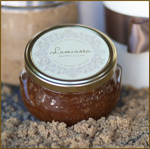

## The rich, warm scent is a decadent treat in the shower

_Stir with cinnamon stick to mix up oil, rub vigorously all over body, rinse and pat dry.
No need to moisturize after, your skin will be soft and dewey.  Keep cinnamon stick in jar.  **Use with caution**- oils in scrub make surfaces very slippery!_

_Ingredients:
Carthamus Tinctorius (Safflower) Seed Oil, Brown Sugar, Turbinado Sugar, Helianthus Annuus (Sunflower) Oil, Sea Salt, Caprylhydroxamic Acid, Caprylyl Glycol, Cinnamon, Fragrance (Parfum), Glycerin, Tocopherol_