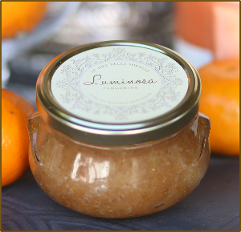

## The invigorating yet sweet scent is the perfect way to begin your day

Stir with cinnamon stick to mix up oil, rub vigorously all over body, rinse and pat dry.
No need to moisturize after, your skin will be soft and dewey.  Keep cinnamon stick in jar. Use with caution- oils in scrub make surfaces very slippery!

_Ingredients:
Brown Sugar, Turbinado Sugar, Carthamus Tinctorius (Safflower) Seed Oil, Helianthus Annuus (Sunflower) Oil, Citrus Reticulata (Tangerine) Oil, Caprylhydroxamic Acid, Caprylyl Glycol, Cinnamon, Fragrance (Parfum), Glycerin, Simmondsia Chinensis (Jojoba) Seed Oil, Tocopherol_