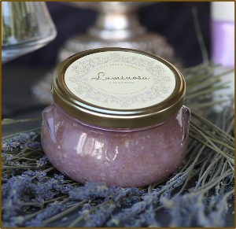

## The tranquil aromatherapy soothes the mind and relaxes the spirit

Stir with cinnamon stick to mix up oil, rub vigorously all over body, rinse and pat dry.
No need to moisturize after, your skin will be soft and dewey.  Keep cinnamon stick in jar. Use with caution- oils in scrub make surfaces very slippery!

_Ingredients:
Brown Sugar, Turbinado Sugar, Carthamus Tinctorius (Safflower) Seed Oil, Sea Salt, Helianthus Annuus (Sunflower) Oil, Caprylhydroxamic Acid, Caprylyl Glycol, Cinnamon, Fragrance (Parfum), Glycerin, Lavandula Angustifolia (Lavender) Oil, Simmondsia Chinensis (Jojoba) Seed Oil, Sodium Aluminosilicate Violet, Tocopherol_